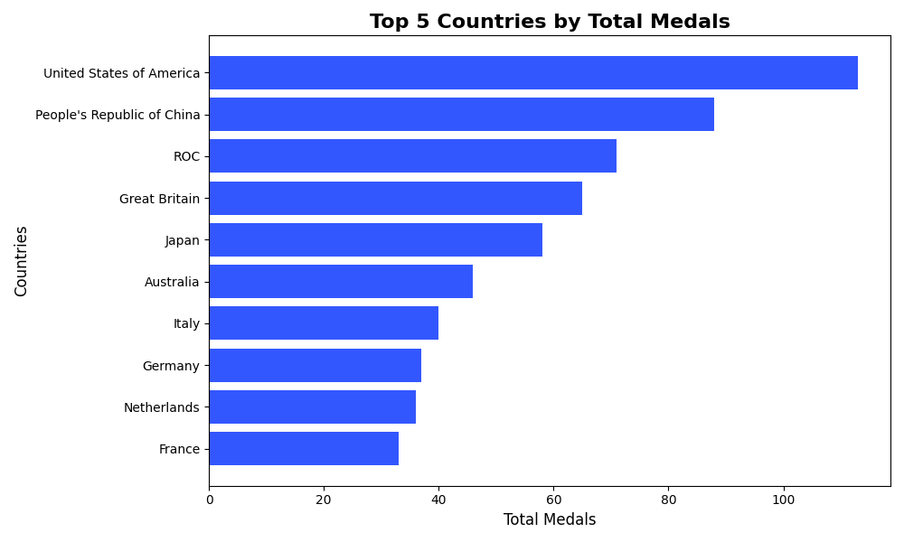
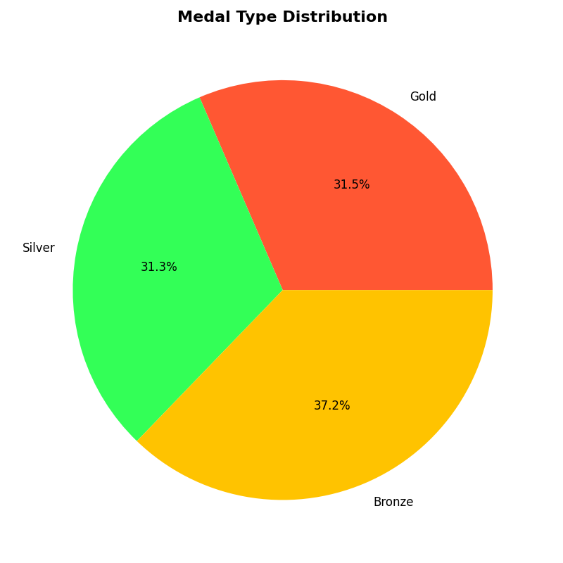
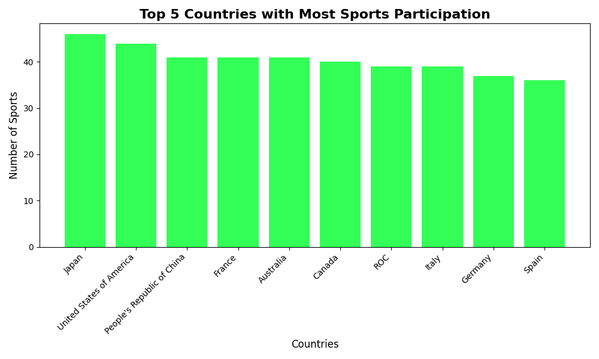

# 🏅 Tokyo Olympics Data Analysis Project 🌐

Welcome to the **Tokyo Olympics Data Analysis Project**! This project dives deep into analyzing data from the 2021 (2020) Tokyo Olympics using SQL and Python. The dataset contains comprehensive details about athletes, coaches, teams, disciplines, and gender-based entries.

---

## **🔬 Project Overview**
This project showcases:
- 📊 **Relational database creation** using SQLite.
- ⚖️ **Advanced SQL queries** to uncover insights.
- 🎨 **Visualizations** with Python's `matplotlib` and `plotly` libraries.

---

## **🔍 Directory Structure**
The project is structured as follows:
```
Tokyo-Olympics-Data/
├── Data/                # Raw CSV files
├── Plots/               # Visualizations generated by the scripts
├── SQL/                 # SQL scripts
│   ├── create_table.sql   # SQL script to create database tables
├── src/                 # Python scripts
│   ├── execute_sql.py      # Create ddbb structure
│   ├── load_data.py        # Script to load data into SQLite database
│   ├── test_Medals_table.py # Script to test Medals table or others
│   ├── analysis.py         # Execute SQL queries and save results to CSV
│   ├── visualizations.py   # Generate visualizations from analysis results
└── README.md           # Project documentation (this file)
└── olympics.db          # SQlite Database

```

---

## **📈 Database Details**

### **Tables Created**
1. **`Athletes`**:
   - Columns: `PersonName`, `Country`, `Discipline`
   - Description: Contains information about the athletes and their disciplines.

2. **`Coaches`**:
   - Columns: `Name`, `Country`, `Discipline`, `Event`
   - Description: Contains information about the coaches.

3. **`EntriesGender`**:
   - Columns: `Discipline`, `Female`, `Male`, `Total`
   - Description: Records the number of entries by gender in each discipline.

4. **`Medals`**:
   - Columns: `Rank`, `TeamCountry`, `Gold`, `Silver`, `Bronze`, `Total`, `Rank_by_Total`
   - Description: Tracks medal counts for each country.

5. **`Teams`**:
   - Columns: `TeamName`, `Discipline`, `Country`, `Event`
   - Description: Contains information about the teams and events.

### **SQL Scripts**
- **`create_table.sql`**: Defines the schema for the above tables.
- **`queries.sql`**: Includes advanced SQL queries for insights such as:
  - 🏅 Countries with the most medals.
  - 🎈 Distribution of medals by type.
  - 🏋️ Countries participating in the highest number of disciplines.
  - 🏊 Most competitive sports (sports with the highest number of participating countries).

---

## **📚 Data Loading**
The `load_data.py` script loads data from the raw CSV files into the SQLite database. Steps:
1. Define the path to the dataset.
2. Load the data into a relational SQLite database.
3. Create tables as per the schema defined in `create_tables.sql`.

---

## **🔬 Data Analysis**
The `analysis.py` script executes advanced SQL queries to extract insights and saves the results as CSV files in the `output/` directory.

### **Advanced Queries**
Examples of SQL queries included:
1. **Top Countries by Total Medals**:
   ```sql
   SELECT TeamCountry, SUM(Gold + Silver + Bronze) AS TotalMedals
   FROM Medals
   GROUP BY TeamCountry
   ORDER BY TotalMedals DESC
   LIMIT 10;
   ```

2. **Distribution of Medal Types**:
   ```sql
   SELECT SUM(Gold) AS TotalGold, SUM(Silver) AS TotalSilver, SUM(Bronze) AS TotalBronze
   FROM Medals;
   ```

3. **Countries Participating in the Most Disciplines**:
   ```sql
   SELECT Country, COUNT(DISTINCT Discipline) AS TotalDisciplines
   FROM Teams
   GROUP BY Country
   ORDER BY TotalDisciplines DESC
   LIMIT 10;
   ```

---

## **🎨 Visualizations**
The `visualizations.py` script generates plots to visually represent the data and analysis results.

### **Generated Visualizations**
1. **🏅 Top 10 Countries by Total Medals**:
   - 
   - Saved as `plots/top_countries_by_medals.png`.

2. **🎈 Medal Type Distribution**:
   - 
   - Saved as `plots/medal_type_distribution.png`.

3. **🏋️ Countries with the Most Disciplines**:
   - 
   - Saved as `plots/countries_with_most_disciplines.png`.

4. **🏊 Most Competitive Sports**:
   - 
   - Saved as `plots/countries_with_most_sports.png`.

---

## **🚀 Technologies Used**
1. **SQLite**:
   - Relational database for data storage and querying.
2. **Python**:
   - Libraries: `pandas`, `matplotlib`, `plotly`, `sqlite3`.
3. **Matplotlib & Plotly**:
   - For generating visualizations.

---

## **🔧 Setup Instructions**
1. Clone this repository:
   ```bash
   git clone <repository_url>
   ```
2. Navigate to the project directory:
   ```bash
   cd Tokyo-Olympics-Data
   ```
3. Install dependencies:
   ```bash
   pip install -r requirements.txt
   ```
4. Run the scripts in the following order:
   - Load the data:
     ```bash
     python src/load_data.py
     ```
   - Run the analysis:
     ```bash
     python src/analysis.py
     ```
   - Generate visualizations:
     ```bash
     python src/visualizations.py
     ```

---

## **🎯 Future Improvements**
- ⚙️ Incorporate machine learning models for predictive analytics (e.g., predicting medal counts).
- 🔢 Add more visualizations and interactive dashboards.
- 🔎 Expand the dataset with more detailed athlete and event data.

---

## **🔍 Credits**
- Dataset Source: [Kaggle](https://www.kaggle.com/datasets/arjunprasadsarkhel/2021-olympics-in-tokyo/data).
- Author: ILyd Bautista.


